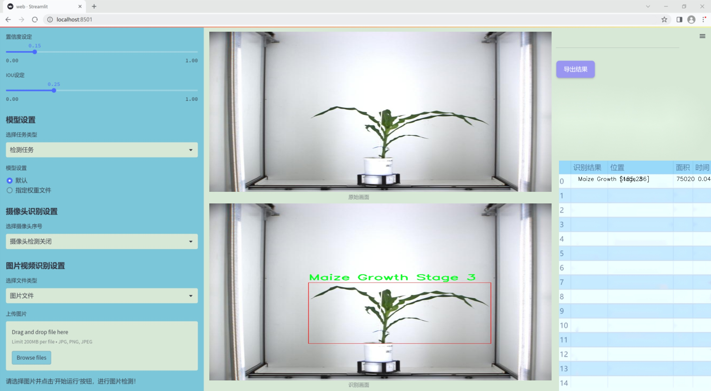
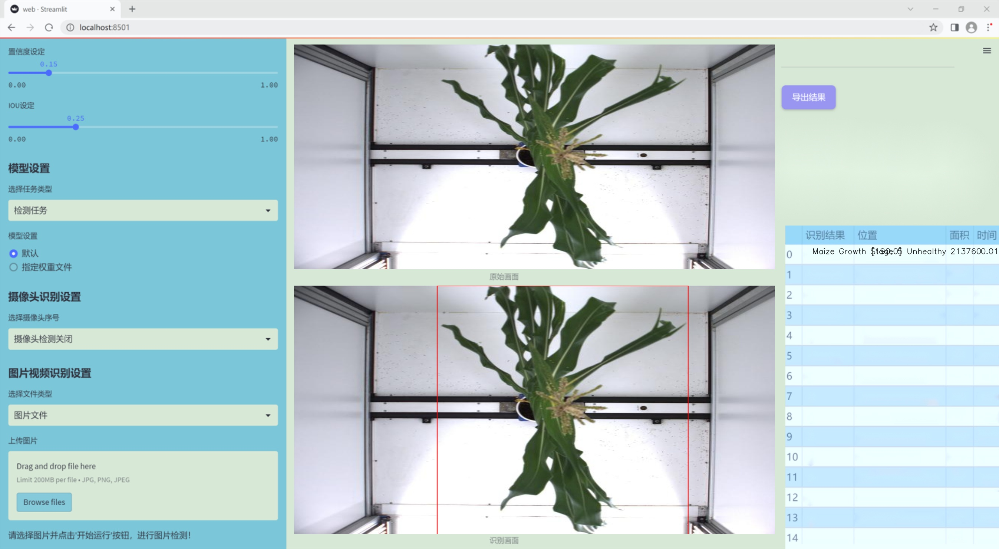
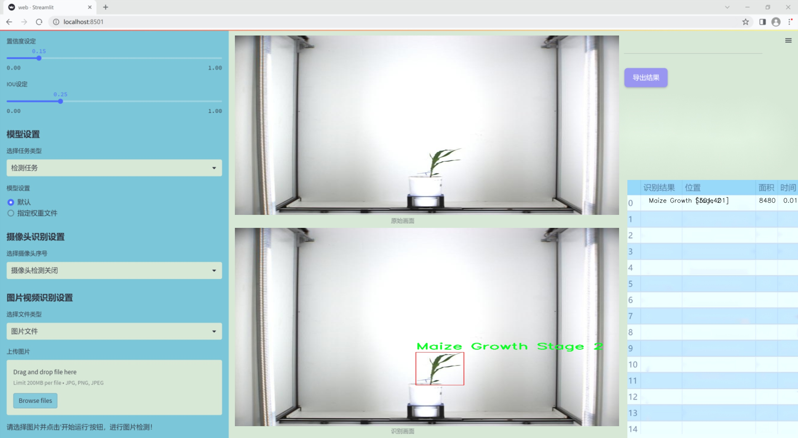
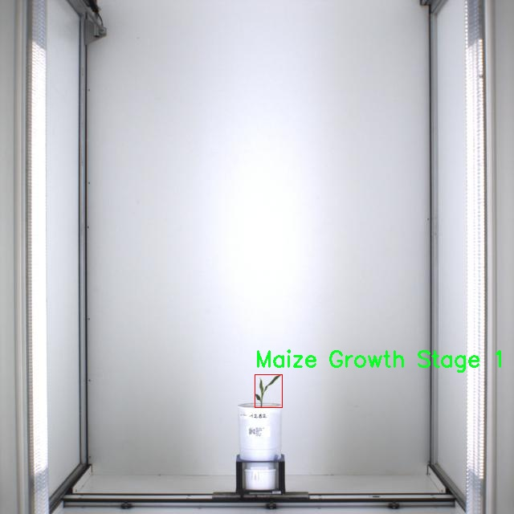
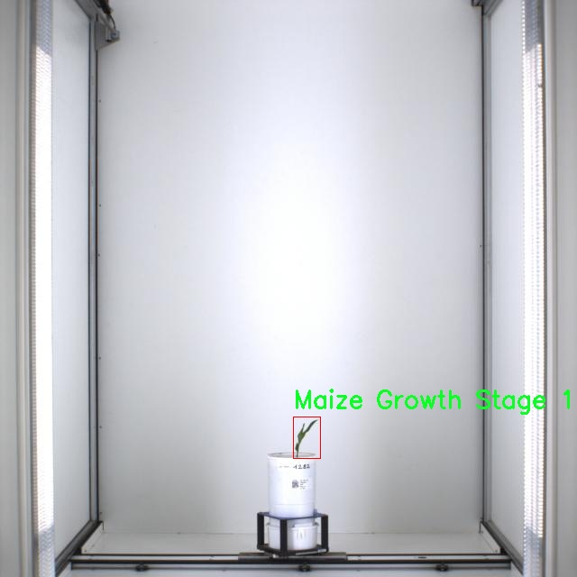
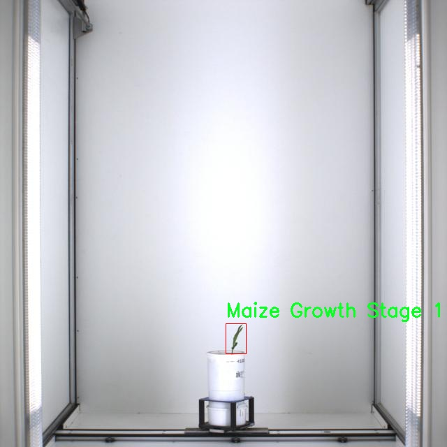
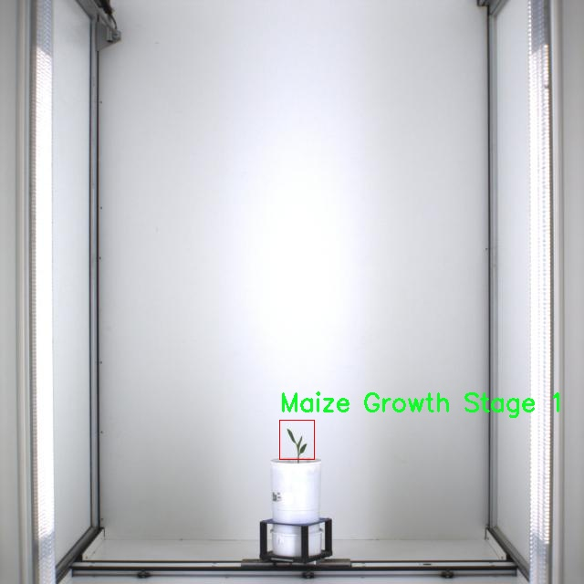
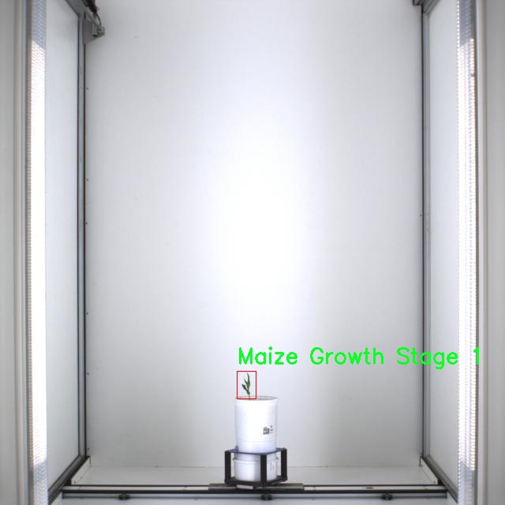

# 改进yolo11-DLKA等200+全套创新点大全：玉米生长阶段检测系统源码＆数据集全套

### 1.图片效果展示







##### 项目来源 **[人工智能促进会 2024.10.24](https://kdocs.cn/l/cszuIiCKVNis)**

注意：由于项目一直在更新迭代，上面“1.图片效果展示”和“2.视频效果展示”展示的系统图片或者视频可能为老版本，新版本在老版本的基础上升级如下：（实际效果以升级的新版本为准）

  （1）适配了YOLOV11的“目标检测”模型和“实例分割”模型，通过加载相应的权重（.pt）文件即可自适应加载模型。

  （2）支持“图片识别”、“视频识别”、“摄像头实时识别”三种识别模式。

  （3）支持“图片识别”、“视频识别”、“摄像头实时识别”三种识别结果保存导出，解决手动导出（容易卡顿出现爆内存）存在的问题，识别完自动保存结果并导出到tempDir中。

  （4）支持Web前端系统中的标题、背景图等自定义修改。

  另外本项目提供训练的数据集和训练教程,暂不提供权重文件（best.pt）,需要您按照教程进行训练后实现图片演示和Web前端界面演示的效果。

### 2.视频效果展示

[2.1 视频效果展示](https://www.bilibili.com/video/BV1A9yyYDEf3/)

### 3.背景

研究背景与意义

随着全球人口的不断增长，粮食安全问题日益凸显，玉米作为全球重要的粮食作物之一，其生长阶段的准确监测对于提高农业生产效率、优化资源配置以及实现可持续发展具有重要意义。传统的玉米生长阶段检测方法往往依赖于人工观察，不仅耗时耗力，而且受主观因素影响较大，导致检测结果的准确性和一致性难以保证。因此，基于计算机视觉技术的自动化检测系统应运而生，成为提升农业生产管理水平的重要工具。

近年来，深度学习技术的迅猛发展为物体检测领域带来了新的机遇，尤其是YOLO（You Only Look Once）系列模型以其高效的实时检测能力和较高的准确率，广泛应用于农业图像分析中。YOLOv11作为该系列的最新版本，具备更强的特征提取能力和更快的处理速度，能够在复杂的农业环境中实现对玉米生长阶段的精确识别。通过改进YOLOv11模型，我们可以更好地适应玉米生长阶段检测的需求，尤其是在不同生长阶段和健康状态下的玉米样本识别。

本研究所使用的数据集包含1500张玉米生长阶段的图像，涵盖了从生长阶段1到阶段5的各个状态，并特别标注了健康与不健康的样本。这一数据集的构建为模型的训练和验证提供了坚实的基础，确保了检测系统的准确性和可靠性。通过对玉米生长阶段的自动化检测，不仅可以提高农业生产的效率，还能为农民提供科学的决策支持，推动精准农业的发展。因此，基于改进YOLOv11的玉米生长阶段检测系统的研究，不仅具有重要的学术价值，也为实际农业生产提供了切实可行的解决方案。

### 4.数据集信息展示

##### 4.1 本项目数据集详细数据（类别数＆类别名）

nc: 6
names: ['Maize Growth Stage 1', 'Maize Growth Stage 2', 'Maize Growth Stage 3', 'Maize Growth Stage 4', 'Maize Growth Stage 5 Unhealthy', 'Maize Growth Stage 5']


该项目为【目标检测】数据集，请在【训练教程和Web端加载模型教程（第三步）】这一步的时候按照【目标检测】部分的教程来训练

##### 4.2 本项目数据集信息介绍

本项目数据集信息介绍

在本项目中，我们使用的“Capstone Maize Growth”数据集旨在为改进YOLOv11的玉米生长阶段检测系统提供高质量的训练数据。该数据集包含六个类别，涵盖了玉米在不同生长阶段的状态，具体包括“Maize Growth Stage 1”、“Maize Growth Stage 2”、“Maize Growth Stage 3”、“Maize Growth Stage 4”、“Maize Growth Stage 5 Unhealthy”以及“Maize Growth Stage 5”。这些类别的设计旨在准确反映玉米生长过程中的各个阶段及其健康状况，确保模型能够在实际应用中有效识别和分类。

数据集中的每个类别都代表了玉米生长过程中的一个特定阶段，从初期的发芽到成熟的收获阶段，甚至包括可能出现的病态表现。这种细致的分类不仅有助于提高模型的识别精度，还能为农业管理提供重要的决策支持。例如，识别“Maize Growth Stage 5 Unhealthy”类别的能力，可以帮助农民及时发现和处理病虫害问题，从而提高作物的产量和质量。

数据集的构建过程中，收集了大量来自不同环境和条件下的玉米生长图像，确保了数据的多样性和代表性。这种多样性使得训练出的模型在面对实际应用时，能够更好地适应不同的生长环境和条件变化。此外，数据集的标注过程经过严格审核，确保每个图像的类别标注准确无误，为模型的训练提供了可靠的基础。

通过使用“Capstone Maize Growth”数据集，我们期望能够显著提升YOLOv11在玉米生长阶段检测中的性能，使其在农业领域的应用更加广泛和有效。











### 5.全套项目环境部署视频教程（零基础手把手教学）

[5.1 所需软件PyCharm和Anaconda安装教程（第一步）](https://www.bilibili.com/video/BV1BoC1YCEKi/?spm_id_from=333.999.0.0&vd_source=bc9aec86d164b67a7004b996143742dc)


[5.2 安装Python虚拟环境创建和依赖库安装视频教程（第二步）](https://www.bilibili.com/video/BV1ZoC1YCEBw?spm_id_from=333.788.videopod.sections&vd_source=bc9aec86d164b67a7004b996143742dc)

### 6.改进YOLOv11训练教程和Web_UI前端加载模型教程（零基础手把手教学）

[6.1 改进YOLOv11训练教程和Web_UI前端加载模型教程（第三步）](https://www.bilibili.com/video/BV1BoC1YCEhR?spm_id_from=333.788.videopod.sections&vd_source=bc9aec86d164b67a7004b996143742dc)


按照上面的训练视频教程链接加载项目提供的数据集，运行train.py即可开始训练



     Epoch   gpu_mem       box       obj       cls    labels  img_size
     1/200     20.8G   0.01576   0.01955  0.007536        22      1280: 100%|██████████| 849/849 [14:42<00:00,  1.04s/it]
               Class     Images     Labels          P          R     mAP@.5 mAP@.5:.95: 100%|██████████| 213/213 [01:14<00:00,  2.87it/s]
                 all       3395      17314      0.994      0.957      0.0957      0.0843

     Epoch   gpu_mem       box       obj       cls    labels  img_size
     2/200     20.8G   0.01578   0.01923  0.007006        22      1280: 100%|██████████| 849/849 [14:44<00:00,  1.04s/it]
               Class     Images     Labels          P          R     mAP@.5 mAP@.5:.95: 100%|██████████| 213/213 [01:12<00:00,  2.95it/s]
                 all       3395      17314      0.996      0.956      0.0957      0.0845

     Epoch   gpu_mem       box       obj       cls    labels  img_size
     3/200     20.8G   0.01561    0.0191  0.006895        27      1280: 100%|██████████| 849/849 [10:56<00:00,  1.29it/s]
               Class     Images     Labels          P          R     mAP@.5 mAP@.5:.95: 100%|███████   | 187/213 [00:52<00:00,  4.04it/s]
                 all       3395      17314      0.996      0.957      0.0957      0.0845


###### [项目数据集下载链接](https://kdocs.cn/l/cszuIiCKVNis)

### 7.原始YOLOv11算法讲解


###### YOLOv11改进方向

与YOLOv 10相比，YOLOv 11有了巨大的改进，包括但不限于：

  * 增强的模型结构：模型具有改进的模型结构，以获取图像处理并形成预测
  * GPU优化：这是现代ML模型的反映，GPU训练ML模型在速度和准确性上都更好。
  * 速度：YOLOv 11模型现在经过增强和GPU优化以用于训练。通过优化，这些模型比它们的前版本快得多。在速度上达到了25%的延迟减少！
  * 更少的参数：更少的参数允许更快的模型，但v11的准确性不受影响
  * 更具适应性：更多支持的任务YOLOv 11支持多种类型的任务、多种类型的对象和多种类型的图像。

###### YOLOv11功能介绍

Glenn Jocher和他的团队制作了一个令人敬畏的YOLOv 11迭代，并且在图像人工智能的各个方面都提供了YOLO。YOLOv 11有多种型号，包括：

  * 对象检测-在训练时检测图像中的对象
  * 图像分割-超越对象检测，分割出图像中的对象
  * 姿态检测-当用点和线训练时绘制一个人的姿势
  * 定向检测（OBB）：类似于对象检测，但包围盒可以旋转
  * 图像分类-在训练时对图像进行分类

使用Ultralytics Library，这些模型还可以进行优化，以：

  * 跟踪-可以跟踪对象的路径
  * 易于导出-库可以以不同的格式和目的导出
  * 多场景-您可以针对不同的对象和图像训练模型

此外，Ultralytics还推出了YOLOv 11的企业模型，该模型将于10月31日发布。这将与开源的YOLOv
11模型并行，但将拥有更大的专有Ultralytics数据集。YOLOv 11是“建立在过去的成功”的其他版本的之上。

###### YOLOv11模型介绍

YOLOv 11附带了边界框模型（无后缀），实例分割（-seg），姿态估计（-pose），定向边界框（-obb）和分类（-cls）。

这些也有不同的尺寸：纳米（n），小（s），中（m），大（l），超大（x）。


YOLOv11模型

###### YOLOv11与前版本对比

与YOLOv10和YOLOv8相比，YOLOv11在Ultralytics的任何帖子中都没有直接提到。所以我会收集所有的数据来比较它们。感谢Ultralytics：

**检测：**


YOLOv11检测统计


YOLOv10检测统计

其中，Nano的mAPval在v11上为39.5，v10上为38.5；Small为47.0 vs 46.3，Medium为51.5 vs
51.1，Large为53.4 vs 53.2，Extra Large为54.7vs
54.4。现在，这可能看起来像是一种增量增加，但小小数的增加可能会对ML模型产生很大影响。总体而言，YOLOv11以0.3
mAPval的优势追平或击败YOLOv10。

现在，我们必须看看速度。在延迟方面，Nano在v11上为1.55 , v10上为1.84，Small为2.46 v2.49，Medium为4.70
v4.74，Large为6.16 v7.28，Extra Large为11.31
v10.70。延迟越低越好。YOLOv11提供了一个非常低的延迟相比，除了特大做得相当差的前身。

总的来说，Nano模型是令人振奋的，速度更快，性能相当。Extra Large在性能上有很好的提升，但它的延迟非常糟糕。

**分割：**


YOLOV11 分割统计


YOLOV9 分割统计


YOLOV8 分割数据

总体而言，YOLOv 11上的分割模型在大型和超大型模型方面比上一代YOLOv 8和YOLOv 9做得更好。

YOLOv 9 Segmentation没有提供任何关于延迟的统计数据。比较YOLOv 11延迟和YOLOv 8延迟，发现YOLOv 11比YOLOv
8快得多。YOLOv 11将大量GPU集成到他们的模型中，因此期望他们的模型甚至比CPU测试的基准更快！

姿态估计：


YOLOV11姿态估计统计


YOLOV8姿态估计统计

YOLOv 11的mAP 50 -95统计量也逐渐优于先前的YOLOv 8（除大型外）。然而，在速度方面，YOLOv
11姿势可以最大限度地减少延迟。其中一些延迟指标是版本的1/4！通过对这些模型进行GPU训练优化，我可以看到指标比显示的要好得多。

**定向边界框：**


YOLOv11 OBB统计


YOLOv8 OBB统计

OBB统计数据在mAP
50上并不是很好，只有非常小的改进，在某种程度上小于检测中的微小改进。然而，从v8到v11的速度减半，这表明YOLOv11在速度上做了很多努力。

**最后，分类：**


YOLOv 11 CLS统计


YOLOv8 CLS统计

从v8到v11，准确性也有了微小的提高。然而，速度大幅上升，CPU速度更快的型号。


### 8.200+种全套改进YOLOV11创新点原理讲解

#### 8.1 200+种全套改进YOLOV11创新点原理讲解大全

由于篇幅限制，每个创新点的具体原理讲解就不全部展开，具体见下列网址中的改进模块对应项目的技术原理博客网址【Blog】（创新点均为模块化搭建，原理适配YOLOv5~YOLOv11等各种版本）

[改进模块技术原理博客【Blog】网址链接](https://gitee.com/qunmasj/good)


#### 8.2 精选部分改进YOLOV11创新点原理讲解

###### 这里节选部分改进创新点展开原理讲解(完整的改进原理见上图和[改进模块技术原理博客链接](https://gitee.com/qunmasj/good)【如果此小节的图加载失败可以通过CSDN或者Github搜索该博客的标题访问原始博客，原始博客图片显示正常】
### CBAM空间注意力机制
近年来，随着深度学习研究方向的火热，注意力机制也被广泛地应用在图像识别、语音识别和自然语言处理等领域，注意力机制在深度学习任务中发挥着举足轻重的作用。注意力机制借鉴于人类的视觉系统，例如，人眼在看到一幅画面时，会倾向于关注画面中的重要信息，而忽略其他可见的信息。深度学习中的注意力机制和人类视觉的注意力机制相似，通过扫描全局数据，从大量数据中选择出需要重点关注的、对当前任务更为重要的信息，然后对这部分信息分配更多的注意力资源，从这些信息中获取更多所需要的细节信息，而抑制其他无用的信息。而在深度学习中，则具体表现为给感兴趣的区域更高的权重，经过网络的学习和调整，得到最优的权重分配，形成网络模型的注意力，使网络拥有更强的学习能力，加快网络的收敛速度。
注意力机制通常可分为软注意力机制和硬注意力机制[4-5]。软注意力机制在选择信息时，不是从输入的信息中只选择1个，而会用到所有输入信息，只是各个信息对应的权重分配不同，然后输入网络模型进行计算;硬注意力机制则是从输入的信息中随机选取一个或者选择概率最高的信息，但是这一步骤通常是不可微的，导致硬注意力机制更难训练。因此，软注意力机制应用更为广泛，按照原理可将软注意力机制划分为:通道注意力机制（channel attention)、空间注意力机制(spatial attention）和混合域注意力机制(mixed attention)。
通道注意力机制的本质建立各个特征通道之间的重要程度，对感兴趣的通道进行重点关注，弱化不感兴趣的通道的作用;空间注意力的本质则是建模了整个空间信息的重要程度，然后对空间内感兴趣的区域进行重点关注，弱化其余非感兴趣区域的作用;混合注意力同时运用了通道注意力和空间注意力，两部分先后进行或并行，形成对通道特征和空间特征同时关注的注意力模型。

卷积层注意力模块(Convolutional Block Attention Module，CBAM）是比较常用的混合注意力模块，其先后集中了通道注意力模块和空间注意力模块，网络中加入该模块能有效提高网络性能，减少网络模型的计算量，模块结构如图所示。输入特征图首先经过分支的通道注意力模块，然后和主干的原特征图融合，得到具有通道注意力的特征图，接着经过分支的空间注意力模块，在和主干的特征图融合后，得到同时具有通道特征注意力和空间特征注意力的特征图。CBAM模块不改变输入特征图的大小，因此该模块是一个“即插即用”的模块，可以插入网络的任何位置。

通道注意力模块的结构示意图如图所示，通道注意力模块分支并行地对输入的特征图进行最大池化操作和平均池化操作，然后利用多层感知机对结果进行变换，得到应用于两个通道的变换结果，最后经过sigmoid激活函数将变换结果融合，得到具有通道注意力的通道特征图。

空间注意力模块示意图如图所示，将通道注意力模块输出的特征图作为该模块的输入特征图，首先对输入特征图进行基于通道的最大池化操作和平均池化操作，将两部分得到的结果拼接起来，然后通过卷积得到降为Ⅰ通道的特征图，最后通过sigmoid激活函数生成具有空间注意力的特征图。


### 9.系统功能展示

图9.1.系统支持检测结果表格显示

  图9.2.系统支持置信度和IOU阈值手动调节

  图9.3.系统支持自定义加载权重文件best.pt(需要你通过步骤5中训练获得)

  图9.4.系统支持摄像头实时识别

  图9.5.系统支持图片识别

  图9.6.系统支持视频识别

  图9.7.系统支持识别结果文件自动保存

  图9.8.系统支持Excel导出检测结果数据


### 10. YOLOv11核心改进源码讲解

#### 10.1 wtconv2d.py

以下是对给定代码的核心部分进行提炼和详细注释的结果：

```python
import torch
import torch.nn as nn
import torch.nn.functional as F
from torch.autograd import Function
import pywt

# 创建小波滤波器
def create_wavelet_filter(wave, in_size, out_size, type=torch.float):
    # 生成小波对象
    w = pywt.Wavelet(wave)
    
    # 反转并转换为张量
    dec_hi = torch.tensor(w.dec_hi[::-1], dtype=type)
    dec_lo = torch.tensor(w.dec_lo[::-1], dtype=type)
    
    # 创建分解滤波器
    dec_filters = torch.stack([
        dec_lo.unsqueeze(0) * dec_lo.unsqueeze(1),
        dec_lo.unsqueeze(0) * dec_hi.unsqueeze(1),
        dec_hi.unsqueeze(0) * dec_lo.unsqueeze(1),
        dec_hi.unsqueeze(0) * dec_hi.unsqueeze(1)
    ], dim=0)

    # 扩展滤波器以适应输入通道数
    dec_filters = dec_filters[:, None].repeat(in_size, 1, 1, 1)

    # 创建重构滤波器
    rec_hi = torch.tensor(w.rec_hi[::-1], dtype=type).flip(dims=[0])
    rec_lo = torch.tensor(w.rec_lo[::-1], dtype=type).flip(dims=[0])
    rec_filters = torch.stack([
        rec_lo.unsqueeze(0) * rec_lo.unsqueeze(1),
        rec_lo.unsqueeze(0) * rec_hi.unsqueeze(1),
        rec_hi.unsqueeze(0) * rec_lo.unsqueeze(1),
        rec_hi.unsqueeze(0) * rec_hi.unsqueeze(1)
    ], dim=0)

    # 扩展重构滤波器以适应输出通道数
    rec_filters = rec_filters[:, None].repeat(out_size, 1, 1, 1)

    return dec_filters, rec_filters

# 小波变换
def wavelet_transform(x, filters):
    b, c, h, w = x.shape  # 获取输入张量的形状
    pad = (filters.shape[2] // 2 - 1, filters.shape[3] // 2 - 1)  # 计算填充
    # 进行2D卷积操作
    x = F.conv2d(x, filters.to(x.dtype).to(x.device), stride=2, groups=c, padding=pad)
    x = x.reshape(b, c, 4, h // 2, w // 2)  # 重塑输出张量
    return x

# 逆小波变换
def inverse_wavelet_transform(x, filters):
    b, c, _, h_half, w_half = x.shape  # 获取输入张量的形状
    pad = (filters.shape[2] // 2 - 1, filters.shape[3] // 2 - 1)  # 计算填充
    x = x.reshape(b, c * 4, h_half, w_half)  # 重塑输入张量
    # 进行转置卷积操作
    x = F.conv_transpose2d(x, filters.to(x.dtype).to(x.device), stride=2, groups=c, padding=pad)
    return x

# 定义小波变换类
class WaveletTransform(Function):
    @staticmethod
    def forward(ctx, input, filters):
        ctx.filters = filters  # 保存滤波器
        with torch.no_grad():
            x = wavelet_transform(input, filters)  # 执行小波变换
        return x

    @staticmethod
    def backward(ctx, grad_output):
        grad = inverse_wavelet_transform(grad_output, ctx.filters)  # 计算梯度
        return grad, None

# 定义逆小波变换类
class InverseWaveletTransform(Function):
    @staticmethod
    def forward(ctx, input, filters):
        ctx.filters = filters  # 保存滤波器
        with torch.no_grad():
            x = inverse_wavelet_transform(input, filters)  # 执行逆小波变换
        return x

    @staticmethod
    def backward(ctx, grad_output):
        grad = wavelet_transform(grad_output, ctx.filters)  # 计算梯度
        return grad, None

# 定义小波卷积层
class WTConv2d(nn.Module):
    def __init__(self, in_channels, out_channels, kernel_size=5, stride=1, bias=True, wt_levels=1, wt_type='db1'):
        super(WTConv2d, self).__init__()

        assert in_channels == out_channels  # 输入和输出通道数必须相等

        self.in_channels = in_channels
        self.wt_levels = wt_levels
        self.stride = stride

        # 创建小波滤波器
        self.wt_filter, self.iwt_filter = create_wavelet_filter(wt_type, in_channels, in_channels, torch.float)
        self.wt_filter = nn.Parameter(self.wt_filter, requires_grad=False)
        self.iwt_filter = nn.Parameter(self.iwt_filter, requires_grad=False)

        # 初始化小波变换和逆小波变换
        self.wt_function = wavelet_transform_init(self.wt_filter)
        self.iwt_function = inverse_wavelet_transform_init(self.iwt_filter)

        # 基础卷积层
        self.base_conv = nn.Conv2d(in_channels, in_channels, kernel_size, padding='same', stride=1, groups=in_channels, bias=bias)

        # 小波卷积层
        self.wavelet_convs = nn.ModuleList(
            [nn.Conv2d(in_channels*4, in_channels*4, kernel_size, padding='same', stride=1, groups=in_channels*4, bias=False) for _ in range(self.wt_levels)]
        )

    def forward(self, x):
        # 小波变换过程
        x_ll_in_levels = []
        x_h_in_levels = []
        curr_x_ll = x

        for i in range(self.wt_levels):
            curr_x = self.wt_function(curr_x_ll)  # 执行小波变换
            curr_x_ll = curr_x[:,:,0,:,:]  # 提取低频部分
            
            # 处理高频部分
            x_ll_in_levels.append(curr_x_tag[:,:,0,:,:])
            x_h_in_levels.append(curr_x_tag[:,:,1:4,:,:])

        # 逆小波变换过程
        next_x_ll = 0
        for i in range(self.wt_levels-1, -1, -1):
            curr_x_ll = x_ll_in_levels.pop()
            curr_x_h = x_h_in_levels.pop()
            curr_x = torch.cat([curr_x_ll.unsqueeze(2), curr_x_h], dim=2)  # 合并低频和高频部分
            next_x_ll = self.iwt_function(curr_x)  # 执行逆小波变换

        # 通过基础卷积层处理
        x = self.base_conv(x)
        x = x + next_x_ll  # 添加小波变换的结果

        return x
```

### 代码核心部分解释
1. **小波滤波器创建**：`create_wavelet_filter` 函数生成小波变换和逆变换所需的滤波器。
2. **小波变换和逆变换**：`wavelet_transform` 和 `inverse_wavelet_transform` 函数分别实现小波变换和逆变换，使用卷积和转置卷积操作。
3. **小波变换类**：`WaveletTransform` 和 `InverseWaveletTransform` 类定义了小波变换的前向和反向传播逻辑。
4. **小波卷积层**：`WTConv2d` 类实现了一个卷积层，结合了小波变换和卷积操作，以提取特征并重构输入。

这些核心部分构成了小波卷积网络的基础，允许在图像处理和特征提取中使用小波变换的优势。

这个文件定义了一个名为 `WTConv2d` 的类，主要用于实现基于小波变换的二维卷积操作。代码中使用了 PyTorch 框架，并结合了小波变换的概念，目的是在卷积神经网络中引入小波变换的特性，以便更好地处理图像数据。

首先，文件中导入了必要的库，包括 PyTorch 的核心模块、功能模块、以及用于小波变换的 `pywt` 库。接着，定义了一个 `create_wavelet_filter` 函数，用于生成小波变换的滤波器。这个函数接收小波类型、输入通道数和输出通道数作为参数，利用 `pywt` 库生成小波的分解和重构滤波器，并将其转换为 PyTorch 的张量格式。

然后，定义了两个函数 `wavelet_transform` 和 `inverse_wavelet_transform`，分别用于执行小波变换和逆小波变换。它们使用了 PyTorch 的卷积操作来实现对输入张量的处理，分别将输入张量转换为小波域和从小波域恢复到原始域。

接下来，定义了两个类 `WaveletTransform` 和 `InverseWaveletTransform`，这两个类继承自 `torch.autograd.Function`，用于实现自定义的前向和反向传播操作。它们的 `forward` 方法调用之前定义的小波变换和逆小波变换函数，而 `backward` 方法则实现了梯度的计算。

`wavelet_transform_init` 和 `inverse_wavelet_transform_init` 函数用于初始化小波变换和逆小波变换的操作，这些函数返回一个应用小波变换的函数。

`WTConv2d` 类是整个文件的核心，继承自 `nn.Module`。在初始化方法中，首先检查输入和输出通道数是否相等。然后创建小波变换和逆小波变换的滤波器，并将其设置为不可训练的参数。接着，定义了基本的卷积层和小波卷积层，后者是通过 `nn.ModuleList` 创建的，允许在多个小波层中进行迭代。

在 `forward` 方法中，首先进行小波变换，提取低频和高频信息。然后，使用小波卷积层对高频信息进行处理，并在每个小波层之间传递低频信息。最后，通过逆小波变换将处理后的信息恢复到原始域，并与基本卷积层的输出相加，形成最终的输出。

最后，定义了一个 `_ScaleModule` 类，用于实现对输入张量的缩放操作。这个模块包含一个可训练的权重参数，用于对输入进行缩放。

总体而言，这个文件实现了一个结合小波变换的卷积神经网络模块，旨在提高图像处理任务中的特征提取能力。通过引入小波变换，模型能够在不同的频率层次上捕捉信息，从而增强对图像的表示能力。

#### 10.2 rmt.py

以下是代码中最核心的部分，并附上详细的中文注释：

```python
import torch
import torch.nn as nn
import torch.nn.functional as F

class DWConv2d(nn.Module):
    """ 深度可分离卷积层 """

    def __init__(self, dim, kernel_size, stride, padding):
        super().__init__()
        # 使用 groups=dim 实现深度可分离卷积
        self.conv = nn.Conv2d(dim, dim, kernel_size, stride, padding, groups=dim)

    def forward(self, x: torch.Tensor):
        '''
        x: 输入张量，形状为 (b, h, w, c)
        '''
        x = x.permute(0, 3, 1, 2)  # 将输入张量转换为 (b, c, h, w)
        x = self.conv(x)  # 进行卷积操作
        x = x.permute(0, 2, 3, 1)  # 将输出张量转换回 (b, h, w, c)
        return x


class MaSA(nn.Module):
    """ 多头自注意力机制 """

    def __init__(self, embed_dim, num_heads, value_factor=1):
        super().__init__()
        self.factor = value_factor
        self.embed_dim = embed_dim
        self.num_heads = num_heads
        self.head_dim = self.embed_dim * self.factor // num_heads
        self.key_dim = self.embed_dim // num_heads
        self.scaling = self.key_dim ** -0.5  # 缩放因子
        # 定义线性变换层
        self.q_proj = nn.Linear(embed_dim, embed_dim, bias=True)
        self.k_proj = nn.Linear(embed_dim, embed_dim, bias=True)
        self.v_proj = nn.Linear(embed_dim, embed_dim * self.factor, bias=True)
        self.lepe = DWConv2d(embed_dim, 5, 1, 2)  # 深度可分离卷积用于残差连接
        self.out_proj = nn.Linear(embed_dim * self.factor, embed_dim, bias=True)
        self.reset_parameters()

    def reset_parameters(self):
        # 初始化权重
        nn.init.xavier_normal_(self.q_proj.weight, gain=2 ** -2.5)
        nn.init.xavier_normal_(self.k_proj.weight, gain=2 ** -2.5)
        nn.init.xavier_normal_(self.v_proj.weight, gain=2 ** -2.5)
        nn.init.xavier_normal_(self.out_proj.weight)
        nn.init.constant_(self.out_proj.bias, 0.0)

    def forward(self, x: torch.Tensor, rel_pos):
        '''
        x: 输入张量，形状为 (b, h, w, c)
        rel_pos: 位置关系张量
        '''
        bsz, h, w, _ = x.size()  # 获取输入的批量大小、高度和宽度

        # 线性变换得到查询、键、值
        q = self.q_proj(x)
        k = self.k_proj(x)
        v = self.v_proj(x)
        lepe = self.lepe(v)  # 残差连接

        k *= self.scaling  # 对键进行缩放
        # 重新排列查询和键的形状
        qr = q.view(bsz, h, w, self.num_heads, self.key_dim).permute(0, 3, 1, 2, 4)
        kr = k.view(bsz, h, w, self.num_heads, self.key_dim).permute(0, 3, 1, 2, 4)

        # 计算注意力权重
        qk_mat = qr @ kr.transpose(-1, -2) + rel_pos  # 添加位置关系
        qk_mat = torch.softmax(qk_mat, -1)  # 计算softmax得到注意力权重
        output = torch.matmul(qk_mat, v)  # 计算加权和

        output = output + lepe  # 添加残差连接
        output = self.out_proj(output)  # 最终线性变换
        return output


class FeedForwardNetwork(nn.Module):
    """ 前馈神经网络 """

    def __init__(self, embed_dim, ffn_dim, activation_fn=F.gelu, dropout=0.0):
        super().__init__()
        self.fc1 = nn.Linear(embed_dim, ffn_dim)  # 第一层线性变换
        self.fc2 = nn.Linear(ffn_dim, embed_dim)  # 第二层线性变换
        self.activation_fn = activation_fn  # 激活函数
        self.dropout_module = nn.Dropout(dropout)  # dropout层

    def forward(self, x: torch.Tensor):
        '''
        x: 输入张量，形状为 (b, h, w, c)
        '''
        x = self.fc1(x)  # 通过第一层
        x = self.activation_fn(x)  # 激活
        x = self.dropout_module(x)  # dropout
        x = self.fc2(x)  # 通过第二层
        return x


class VisRetNet(nn.Module):
    """ 视觉恢复网络 """

    def __init__(self, in_chans=3, num_classes=1000, embed_dims=[96, 192, 384, 768], depths=[2, 2, 6, 2], num_heads=[3, 6, 12, 24]):
        super().__init__()
        self.patch_embed = PatchEmbed(in_chans=in_chans, embed_dim=embed_dims[0])  # 图像分块嵌入
        self.layers = nn.ModuleList()  # 存储网络层
        for i_layer in range(len(depths)):
            layer = BasicLayer(embed_dim=embed_dims[i_layer], depth=depths[i_layer], num_heads=num_heads[i_layer])
            self.layers.append(layer)  # 添加层到模块列表

    def forward(self, x):
        '''
        x: 输入张量，形状为 (b, c, h, w)
        '''
        x = self.patch_embed(x)  # 进行图像分块嵌入
        for layer in self.layers:
            x = layer(x)  # 逐层前向传播
        return x


def RMT_T():
    """ 创建 RMT_T 模型 """
    model = VisRetNet(
        embed_dims=[64, 128, 256, 512],
        depths=[2, 2, 8, 2],
        num_heads=[4, 4, 8, 16]
    )
    return model


if __name__ == '__main__':
    model = RMT_T()  # 实例化模型
    inputs = torch.randn((1, 3, 640, 640))  # 随机生成输入
    res = model(inputs)  # 前向传播
    for i in res:
        print(i.size())  # 输出每层的尺寸
```

### 代码说明：
1. **DWConv2d**: 实现了深度可分离卷积，适用于减少参数量和计算量。
2. **MaSA**: 实现了多头自注意力机制，包含查询、键、值的线性变换，并计算注意力权重。
3. **FeedForwardNetwork**: 实现了前馈神经网络，包含两层线性变换和激活函数。
4. **VisRetNet**: 主网络结构，包含图像分块嵌入和多个基本层。
5. **RMT_T**: 用于创建特定配置的模型实例。

该代码构建了一个视觉恢复网络，适用于图像处理任务。

这个程序文件 `rmt.py` 实现了一个基于视觉变换器（Vision Transformer）的深度学习模型，名为 VisRetNet。该模型采用了一种新的注意力机制，结合了多头自注意力（Multi-Head Self-Attention）和相对位置编码（Relative Position Encoding），并通过残差连接和前馈网络进行特征提取。以下是对代码的详细讲解。

首先，文件导入了必要的库，包括 PyTorch 和一些用于构建模型的模块。然后定义了一些基本的组件，例如深度可分离卷积（`DWConv2d`）、相对位置编码（`RelPos2d`）、多头自注意力（`MaSA` 和 `MaSAd`）等。这些组件构成了模型的基础。

`DWConv2d` 类实现了深度可分离卷积，其构造函数接受卷积的维度、核大小、步幅和填充参数。`forward` 方法将输入张量的维度进行调整，以适应卷积操作。

`RelPos2d` 类用于生成二维的相对位置编码。它根据输入的高度和宽度生成一个衰减掩码，用于在自注意力计算中考虑位置关系。

`MaSAd` 和 `MaSA` 类实现了带有衰减机制的多头自注意力。`MaSAd` 类支持基于块的递归，而 `MaSA` 类则是整体的自注意力。它们的 `forward` 方法中，输入张量被分解为查询（Q）、键（K）和值（V），并通过注意力机制进行处理。

`FeedForwardNetwork` 类实现了前馈神经网络，包含两个线性层和激活函数，支持 dropout 和层归一化。

`RetBlock` 类是一个残差块，包含自注意力层和前馈网络。它通过残差连接将输入与输出相加，并支持层缩放。

`PatchMerging` 类用于将输入特征图进行下采样，使用卷积层进行特征的压缩和归一化。

`BasicLayer` 类表示模型中的基本层，包含多个残差块和一个下采样层。它使用相对位置编码来增强自注意力机制。

`LayerNorm2d` 类实现了二维层归一化，适用于处理图像数据。

`PatchEmbed` 类将输入图像分割成不重叠的补丁，并将其嵌入到特征空间中。

`VisRetNet` 类是整个模型的核心，负责构建不同层次的结构，包括补丁嵌入、多个基本层和特征提取。它的构造函数接受多个参数，以配置模型的各个方面。

最后，文件定义了四个函数 `RMT_T`、`RMT_S`、`RMT_B` 和 `RMT_L`，分别用于创建不同规模的 VisRetNet 模型。每个函数返回一个配置好的模型实例。

在 `__main__` 部分，代码创建了一个 `RMT_T` 模型实例，并对一个随机生成的输入张量进行前向传播，输出各层的特征图尺寸。

整体而言，这个文件实现了一个复杂的视觉变换器模型，利用现代深度学习技术进行图像特征提取，适用于各种计算机视觉任务。

#### 10.3 EfficientFormerV2.py

以下是经过简化并添加详细中文注释的核心代码部分：

```python
import torch
import torch.nn as nn
import math
import itertools

class Attention4D(nn.Module):
    """实现4D注意力机制的类"""
    
    def __init__(self, dim=384, key_dim=32, num_heads=8, attn_ratio=4, resolution=7, act_layer=nn.ReLU, stride=None):
        super().__init__()
        self.num_heads = num_heads  # 注意力头的数量
        self.scale = key_dim ** -0.5  # 缩放因子
        self.key_dim = key_dim  # 键的维度
        self.nh_kd = key_dim * num_heads  # 每个头的键的总维度

        # 如果有步幅，则进行下采样
        if stride is not None:
            self.resolution = math.ceil(resolution / stride)  # 计算新的分辨率
            self.stride_conv = nn.Sequential(
                nn.Conv2d(dim, dim, kernel_size=3, stride=stride, padding=1, groups=dim),
                nn.BatchNorm2d(dim),
            )
            self.upsample = nn.Upsample(scale_factor=stride, mode='bilinear')  # 上采样
        else:
            self.resolution = resolution
            self.stride_conv = None
            self.upsample = None

        self.N = self.resolution ** 2  # 注意力矩阵的大小
        self.d = int(attn_ratio * key_dim)  # 输出维度
        self.dh = self.d * num_heads  # 总输出维度
        self.attn_ratio = attn_ratio  # 注意力比率

        # 定义查询、键、值的卷积层
        self.q = nn.Sequential(nn.Conv2d(dim, self.num_heads * self.key_dim, 1), nn.BatchNorm2d(self.num_heads * self.key_dim))
        self.k = nn.Sequential(nn.Conv2d(dim, self.num_heads * self.key_dim, 1), nn.BatchNorm2d(self.num_heads * self.key_dim))
        self.v = nn.Sequential(nn.Conv2d(dim, self.num_heads * self.d, 1), nn.BatchNorm2d(self.num_heads * self.d))

        # 定义局部值的卷积层
        self.v_local = nn.Sequential(
            nn.Conv2d(self.num_heads * self.d, self.num_heads * self.d, kernel_size=3, stride=1, padding=1, groups=self.num_heads * self.d),
            nn.BatchNorm2d(self.num_heads * self.d),
        )

        # 定义注意力机制中的投影层
        self.proj = nn.Sequential(act_layer(), nn.Conv2d(self.dh, dim, 1), nn.BatchNorm2d(dim))

        # 计算注意力偏置
        points = list(itertools.product(range(self.resolution), range(self.resolution)))
        attention_offsets = {}
        idxs = []
        for p1 in points:
            for p2 in points:
                offset = (abs(p1[0] - p2[0]), abs(p1[1] - p2[1]))
                if offset not in attention_offsets:
                    attention_offsets[offset] = len(attention_offsets)
                idxs.append(attention_offsets[offset])
        self.attention_biases = nn.Parameter(torch.zeros(num_heads, len(attention_offsets)))  # 注意力偏置参数
        self.register_buffer('attention_bias_idxs', torch.LongTensor(idxs).view(self.N, self.N))  # 注册缓冲区

    def forward(self, x):  # 前向传播
        B, C, H, W = x.shape  # 获取输入的形状
        if self.stride_conv is not None:
            x = self.stride_conv(x)  # 下采样

        # 计算查询、键、值
        q = self.q(x).flatten(2).reshape(B, self.num_heads, -1, self.N).permute(0, 1, 3, 2)
        k = self.k(x).flatten(2).reshape(B, self.num_heads, -1, self.N).permute(0, 1, 2, 3)
        v = self.v(x)
        v_local = self.v_local(v)
        v = v.flatten(2).reshape(B, self.num_heads, -1, self.N).permute(0, 1, 3, 2)

        # 计算注意力权重
        attn = (q @ k) * self.scale + self.attention_biases[:, self.attention_bias_idxs]
        attn = attn.softmax(dim=-1)  # 归一化

        # 计算输出
        x = (attn @ v)
        out = x.transpose(2, 3).reshape(B, self.dh, self.resolution, self.resolution) + v_local
        if self.upsample is not None:
            out = self.upsample(out)  # 上采样

        out = self.proj(out)  # 投影到输出维度
        return out


class EfficientFormerV2(nn.Module):
    """EfficientFormerV2模型的实现"""
    
    def __init__(self, layers, embed_dims=None, mlp_ratios=4, downsamples=None, num_classes=1000, resolution=640):
        super().__init__()
        self.patch_embed = nn.Conv2d(3, embed_dims[0], kernel_size=3, stride=2, padding=1)  # 输入层

        network = []
        for i in range(len(layers)):
            # 构建每一层的网络
            stage = eformer_block(embed_dims[i], i, layers)
            network.append(stage)
            if downsamples[i] or embed_dims[i] != embed_dims[i + 1]:
                # 如果需要下采样
                network.append(Embedding(patch_size=3, stride=2, in_chans=embed_dims[i], embed_dim=embed_dims[i + 1]))

        self.network = nn.ModuleList(network)  # 将网络层保存为ModuleList
        self.num_classes = num_classes  # 类别数

    def forward(self, x):
        x = self.patch_embed(x)  # 通过输入层
        for block in self.network:
            x = block(x)  # 通过每一层
        return x  # 返回输出
```

### 代码说明：
1. **Attention4D类**：实现了一个4D注意力机制，包含了查询、键、值的计算，以及注意力权重的计算和应用。
2. **EfficientFormerV2类**：构建了EfficientFormerV2模型的结构，包括输入层和多个网络层的组合。模型的前向传播方法依次通过每一层进行计算，最终返回输出。

以上是代码的核心部分和详细注释，帮助理解其结构和功能。

这个程序文件实现了一个名为EfficientFormerV2的深度学习模型，主要用于图像处理任务。该模型基于高效的变换器架构，旨在提高计算效率和模型性能。文件中定义了多个类和函数，构成了模型的整体结构。

首先，程序导入了必要的库，包括PyTorch及其相关模块，数学库和一些工具函数。接着，定义了一些与模型结构相关的超参数，如不同规模的模型的宽度和深度，这些参数以字典的形式存储，方便后续调用。

接下来，定义了多个类，其中最重要的是Attention4D、Attention4DDownsample、Embedding、Mlp、AttnFFN和FFN等。这些类实现了模型的不同组件，如多头自注意力机制、前馈网络、嵌入层等。Attention4D类实现了四维注意力机制，支持不同分辨率的输入，并且可以选择是否进行下采样。Embedding类则负责将输入图像转换为嵌入表示，使用卷积层和可选的注意力机制。Mlp类实现了多层感知机结构，包含了前向传播和激活函数等。

在EfficientFormerV2类中，构建了整个网络的结构。该类的初始化方法接收多个参数，包括层数、嵌入维度、下采样策略等。通过调用eformer_block函数，构建了多个块，每个块由注意力层和前馈网络组成，并根据需要进行下采样。模型的输出层也通过归一化层进行处理，以提高模型的稳定性和性能。

文件还定义了一些辅助函数，如update_weight用于更新模型权重，efficientformerv2_s0、efficientformerv2_s1、efficientformerv2_s2和efficientformerv2_l等函数用于创建不同规模的EfficientFormerV2模型。这些函数可以加载预训练权重，以便在特定任务上进行微调。

最后，在主程序中，创建了输入张量并测试了不同规模的EfficientFormerV2模型，输出了每个模型的结果尺寸。这一部分代码展示了如何使用定义的模型进行实际的推理操作。

总体来说，这个程序文件通过定义高效的深度学习模型结构，提供了一种灵活的方式来处理图像数据，适用于各种计算机视觉任务。

#### 10.4 deconv.py

以下是经过简化和注释的核心代码部分：

```python
import math
import torch
from torch import nn
from einops.layers.torch import Rearrange

# 定义一个卷积层的类，带有自定义的权重获取方法
class Conv2d_cd(nn.Module):
    def __init__(self, in_channels, out_channels, kernel_size=3, stride=1,
                 padding=1, dilation=1, groups=1, bias=False, theta=1.0):
        super(Conv2d_cd, self).__init__()
        # 初始化标准卷积层
        self.conv = nn.Conv2d(in_channels, out_channels, kernel_size=kernel_size, stride=stride, padding=padding, dilation=dilation, groups=groups, bias=bias)
        self.theta = theta  # 自定义参数

    def get_weight(self):
        # 获取卷积层的权重
        conv_weight = self.conv.weight
        conv_shape = conv_weight.shape
        # 将权重重排为 (c_in, c_out, k1*k2) 的形状
        conv_weight = Rearrange('c_in c_out k1 k2 -> c_in c_out (k1 k2)')(conv_weight)
        
        # 创建一个新的权重张量，初始化为0
        conv_weight_cd = torch.zeros(conv_shape[0], conv_shape[1], 3 * 3, device=conv_weight.device, dtype=conv_weight.dtype)
        # 将原权重复制到新的权重张量
        conv_weight_cd[:, :, :] = conv_weight[:, :, :]
        # 计算新的权重
        conv_weight_cd[:, :, 4] = conv_weight[:, :, 4] - conv_weight[:, :, :].sum(2)
        # 将权重重排回 (c_in, c_out, k1, k2) 的形状
        conv_weight_cd = Rearrange('c_in c_out (k1 k2) -> c_in c_out k1 k2', k1=conv_shape[2], k2=conv_shape[3])(conv_weight_cd)
        return conv_weight_cd, self.conv.bias  # 返回新的权重和偏置


# 定义一个包含多个卷积层的模型
class DEConv(nn.Module):
    def __init__(self, dim):
        super(DEConv, self).__init__()
        # 初始化多个自定义卷积层
        self.conv1_1 = Conv2d_cd(dim, dim, 3, bias=True)
        self.conv1_2 = Conv2d_cd(dim, dim, 3, bias=True)  # 这里使用了 Conv2d_cd 作为示例
        self.conv1_5 = nn.Conv2d(dim, dim, 3, padding=1, bias=True)  # 标准卷积层
        self.bn = nn.BatchNorm2d(dim)  # 批归一化层
        self.act = nn.ReLU()  # 激活函数

    def forward(self, x):
        # 获取每个卷积层的权重和偏置
        w1, b1 = self.conv1_1.get_weight()
        w2, b2 = self.conv1_2.get_weight()
        w5, b5 = self.conv1_5.weight, self.conv1_5.bias

        # 将所有权重和偏置相加
        w = w1 + w2 + w5
        b = b1 + b2 + b5
        # 使用合并后的权重和偏置进行卷积操作
        res = nn.functional.conv2d(input=x, weight=w, bias=b, stride=1, padding=1, groups=1)
        
        # 应用批归一化和激活函数
        res = self.bn(res)
        return self.act(res)

    def switch_to_deploy(self):
        # 在部署时合并权重和偏置
        w1, b1 = self.conv1_1.get_weight()
        w2, b2 = self.conv1_2.get_weight()
        w5, b5 = self.conv1_5.weight, self.conv1_5.bias

        # 更新卷积层的权重和偏置
        self.conv1_5.weight = torch.nn.Parameter(w1 + w2 + w5)
        self.conv1_5.bias = torch.nn.Parameter(b1 + b2 + b5)
        
        # 删除不再需要的卷积层
        del self.conv1_1
        del self.conv1_2

# 测试代码
if __name__ == '__main__':
    data = torch.randn((1, 128, 64, 64)).cuda()  # 创建输入数据
    model = DEConv(128).cuda()  # 初始化模型
    output1 = model(data)  # 前向传播
    model.switch_to_deploy()  # 切换到部署模式
    output2 = model(data)  # 再次前向传播
    print(torch.allclose(output1, output2))  # 检查输出是否相同
```

### 代码注释说明：
1. **卷积层类**：`Conv2d_cd` 类定义了一个自定义的卷积层，重写了 `get_weight` 方法以获取经过处理的权重。
2. **模型类**：`DEConv` 类包含多个卷积层，并在 `forward` 方法中合并它们的权重进行卷积操作。
3. **部署模式**：`switch_to_deploy` 方法用于在模型部署时合并卷积层的权重和偏置，以提高推理效率。
4. **测试部分**：在 `__main__` 中创建输入数据，初始化模型，进行前向传播并验证输出的一致性。

这个程序文件 `deconv.py` 定义了一系列卷积层的类，主要用于实现不同类型的卷积操作，并且通过 `DEConv` 类将这些卷积层组合在一起。以下是对代码的详细讲解。

首先，程序导入了必要的库，包括 `math`、`torch` 及其 `nn` 模块，以及 `einops` 库中的 `Rearrange` 类，用于重排张量的维度。此外，还导入了自定义的 `Conv` 模块和 `fuse_conv_and_bn` 函数。

接下来，定义了多个卷积类，分别是 `Conv2d_cd`、`Conv2d_ad`、`Conv2d_rd`、`Conv2d_hd` 和 `Conv2d_vd`。每个类都继承自 `nn.Module`，并在初始化时创建了一个标准的二维卷积层 `nn.Conv2d`。这些类的主要功能是重定义卷积权重，以实现不同的卷积变换。

- `Conv2d_cd` 类中，`get_weight` 方法重排卷积权重，并根据特定规则计算新的权重，返回重排后的权重和偏置。
- `Conv2d_ad` 类也有类似的 `get_weight` 方法，但其权重计算方式不同，涉及到对权重的加权和重排。
- `Conv2d_rd` 类在 `forward` 方法中实现了条件判断，根据 `theta` 的值决定是否使用标准卷积或自定义的卷积权重。
- `Conv2d_hd` 和 `Conv2d_vd` 类同样实现了自定义的权重计算逻辑。

最后，`DEConv` 类将上述卷积层组合在一起。它在初始化时创建了多个卷积层，并在 `forward` 方法中将它们的输出加在一起，形成最终的输出。`switch_to_deploy` 方法用于将所有卷积层的权重和偏置合并到最后一个卷积层中，以便在推理时提高效率。

在 `__main__` 部分，程序创建了一个随机输入张量，并实例化 `DEConv` 模型进行前向传播，随后调用 `switch_to_deploy` 方法并再次进行前向传播，最后检查两次输出是否相等，以验证合并后的模型是否正确。

整体而言，这个文件实现了一个复杂的卷积神经网络结构，允许通过不同的卷积变换来处理输入数据，并提供了在训练和推理阶段的灵活性。

注意：由于此博客编辑较早，上面“10.YOLOv11核心改进源码讲解”中部分代码可能会优化升级，仅供参考学习，以“11.完整训练+Web前端界面+200+种全套创新点源码、数据集获取”的内容为准。

### 11.完整训练+Web前端界面+200+种全套创新点源码、数据集获取


# [下载链接：https://mbd.pub/o/bread/Zp6TlJdp](https://mbd.pub/o/bread/Zp6TlJdp)